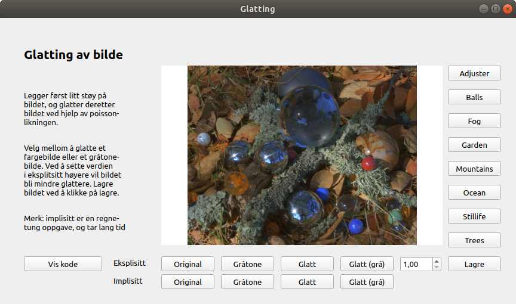

# IMT3881 2020 Prosjekt
## Praktisk gjennømføring

* Lag en _fork_ av dette repoet. Sørg for at
    - det forkede repoet er privat
	- emneansvarlig har lesetilgang ('reporter')
* La både kode og rapport bo i repoet under katalogene _src_ og
  _rapport_.
* Bruk saksbehandlingssystem og kanban-tavle i GitLab
* Sørg for jevnlige commits. Dette dokumenterer arbeidsprosessen. Bruk smart commits for å lenke commits til sakene i saksbehandlingssystemet.
* Levér inn rapport som PDF i Inspera. PDF-en må inneholde URL-en
  til repoet.

## GUI

<p align="center">

</p>

## Installering og start av GUI
Kjør følgende kommandoer under for å installere nødvendig biblioteker og kjøre GUI.

```bash
pip install -r requirements.txt
cd src
python Main.py
```